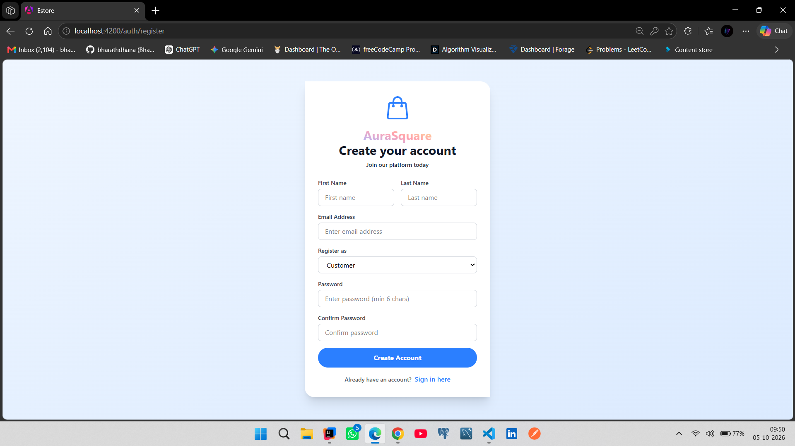
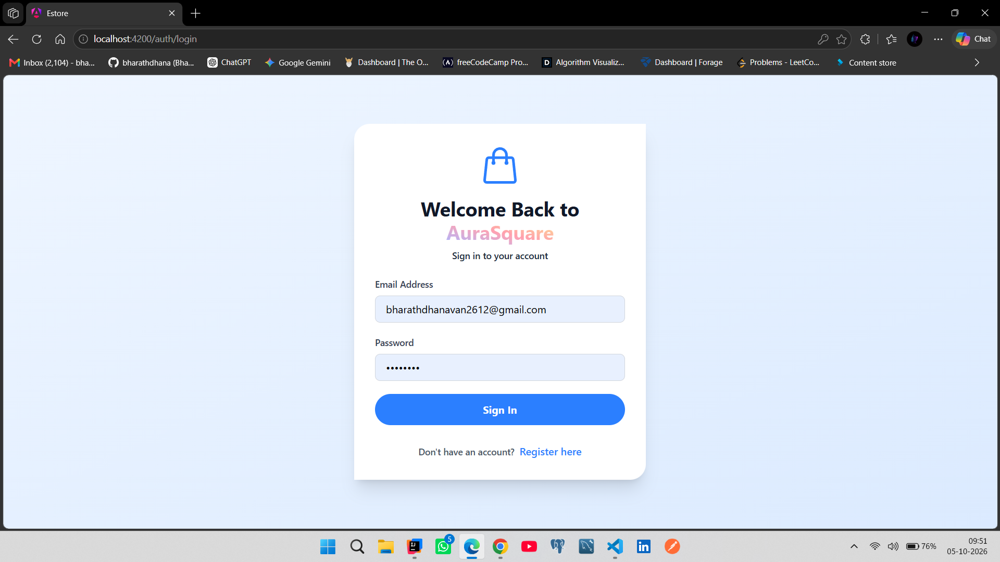
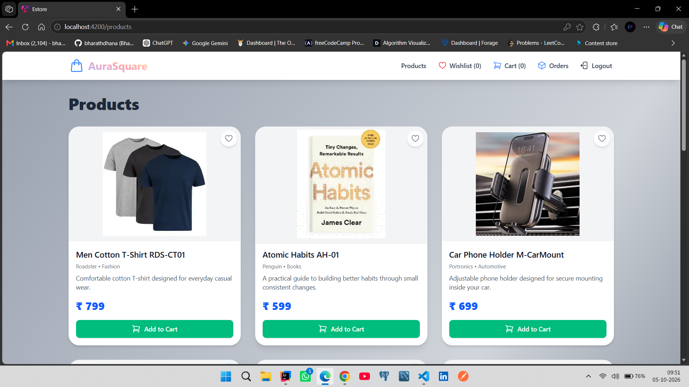
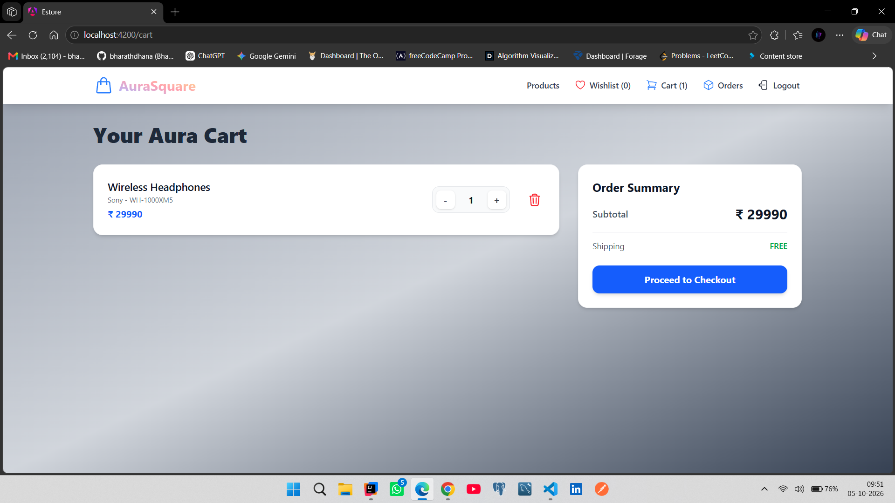
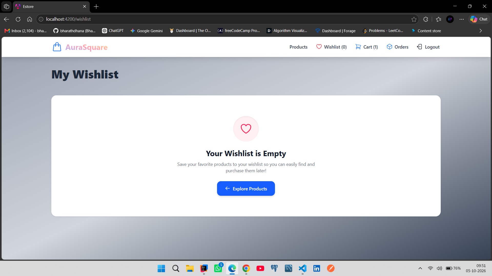
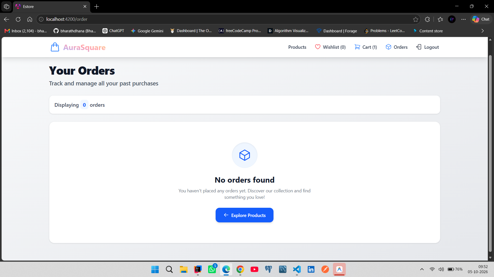
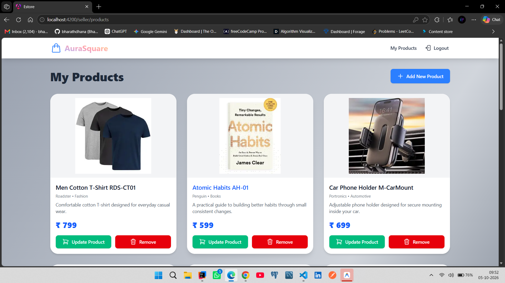
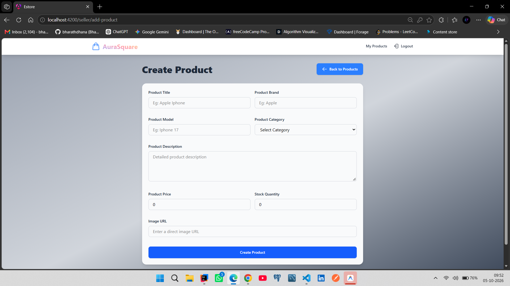
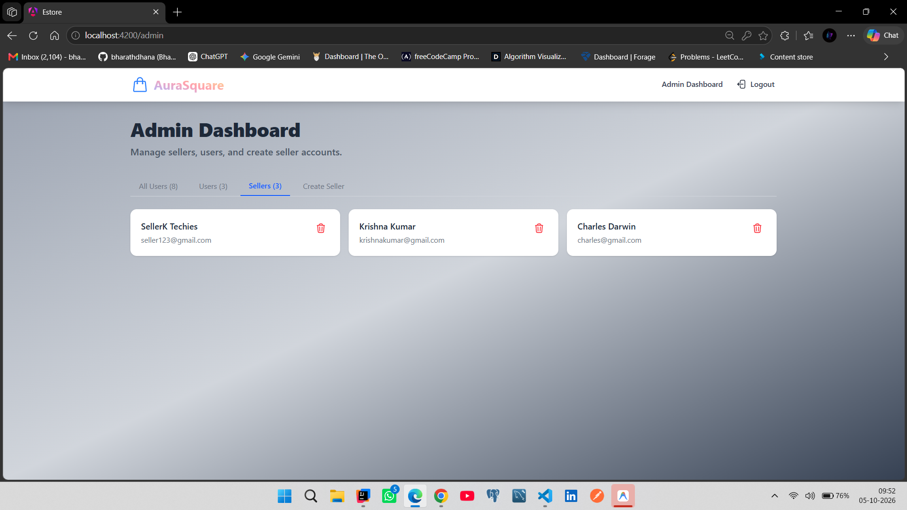
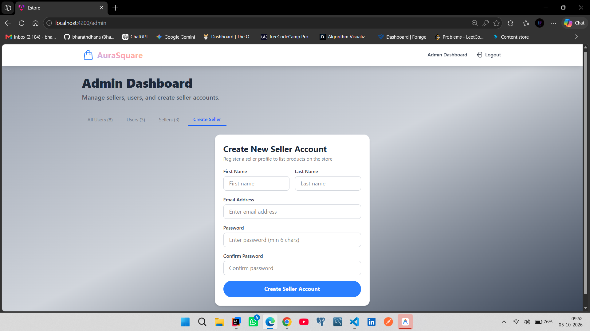

# 🛒 Estore E-Commerce Platform (AuraSquare)

A full-featured, responsive e-commerce web application built with **Angular**, **TypeScript**, **Tailwind CSS**, and **Spring Boot REST API**.

---

## 📸 Application Screens & Key Modules

### 1. User Registration (`/auth/register`)
Allows new users to create an account by filling out their personal details, selecting a role (Customer or Seller), and setting up secure credentials.

<p align="center">
  
</p>

### 2. User Login (`/auth/login`)
Enables existing users to securely sign in to their AuraSquare account using JWT-based authentication.

<p align="center">
  
</p>

### 3. Product Catalog (`/products`)
Displays available store products with images, titles, descriptions, INR pricing, wishlist toggles, and direct add-to-cart controls.

<p align="center">
  
</p>

### 4. Shopping Cart (`/cart`)
Provides an interactive cart summary with quantity controls, subtotal calculation, free shipping indication, and checkout action.

<p align="center">
  
</p>

### 5. My Wishlist (`/wishlist`)
Allows customers to save and organize their favorite products for quick access and future purchases.

<p align="center">
  
</p>

### 6. Order History (`/order`)
Allows customers to review their past orders, status updates, and purchased item details.

<p align="center">
  
</p>

### 7. Seller Product Catalog (`/seller/products`)
Enables sellers to view and manage inventory items specifically listed under their seller profile.

<p align="center">
  
</p>

### 8. Add New Product (`/seller/add-product`)
Provides sellers with a form to publish new store items with details, pricing, stock quantity, and image URLs.

<p align="center">
  
</p>

### 9. Admin Dashboard - Manage Sellers (`/admin`)
Gives administrators full control to manage user accounts, oversee customer/seller activity, and delete or view seller profiles.

<p align="center">
  
</p>

### 10. Admin - Create Seller Account (`/admin`)
Allows administrators to onboard and register new seller accounts directly from the admin interface.

<p align="center">
  
</p>

---

## 📌 Features & Role-Based Access Control (RBAC)

| Role | Access Permissions & Responsibilities |
|---|---|
| **Customer (`USER`)** | Browse catalog, manage Cart & Wishlist, checkout orders with Razorpay, and view Order History. |
| **Seller (`SELLER`)** | Manage seller product inventory, update product listings, and add new store products. |
| **Admin (`ADMIN`)** | Platform administration, view/manage all user accounts, onboard new sellers, and remove accounts. |

- **Security**: JWT token storage in local storage with functional Angular Route Guards (`authGuard`, `guestGuard`, `userGuard`, `sellerGuard`, `adminGuard`).
- **Payment Integration**: Integrated with Razorpay test gateway for order processing.

---

## 🛠️ Tech Stack & System Architecture

- **Frontend**: Angular 21, TypeScript, Tailwind CSS, RxJS, Angular Signals.
- **Backend API**: Spring Boot 3, Java 21+, Spring Security, Spring Data JPA, Lombok.
- **Database**: PostgreSQL / MySQL.

---

## 🚀 Getting Started

### Prerequisites
- **Node.js**: `v20+`
- **npm**: `v10+`
- **Java Development Kit (JDK)**: `v21+`
- **Running Backend API**: `ecommerce-api` on `http://localhost:8080`

### 1. Frontend Setup (`ecommerce-fe/estore`)

```bash
# Navigate to the frontend directory
cd estore

# Install project dependencies
npm install

# Start the Angular development server
npm start
```
Open your browser and navigate to `http://localhost:4200/`.

### 2. Production Build

```bash
npm run build
```

---

## 🔧 Troubleshooting & Resolved Issues

- **Wishlist Service & Component Null Safety**:
  - *Issue*: Backend 500 error when retrieving or modifying wishlist items containing deleted/null product references.
  - *Resolution*: Updated `WishlistServiceImpl.java` with null checks on `item.getProduct()`, filtered out null products in DTO mappings, and added error recovery in Angular `WishlistService` and `WishlistComponent`.

---

## 📁 Directory Structure

```text
src/app/
├── components/
│   ├── admin/              # Admin dashboard & seller creation
│   ├── auth/               # Login & Registration pages
│   ├── cart/               # Cart management & summary
│   ├── checkout/           # Checkout & shipping workflow
│   ├── order-confirmation/ # Order confirmation view
│   ├── order-item/         # Customer order history
│   ├── products/           # Product catalog & browsing
│   ├── seller/             # Seller product catalog & add-product page
│   ├── shared/             # Dynamic role-based Navigation Bar
│   └── wishlist/           # Customer wishlist management
├── guards/                 # Functional Angular Route Guards
├── models/                 # TypeScript interfaces (User, Product, Cart, Order, Wishlist)
├── services/               # HTTP API integration services
└── app.routes.ts           # Application routing configuration
```
